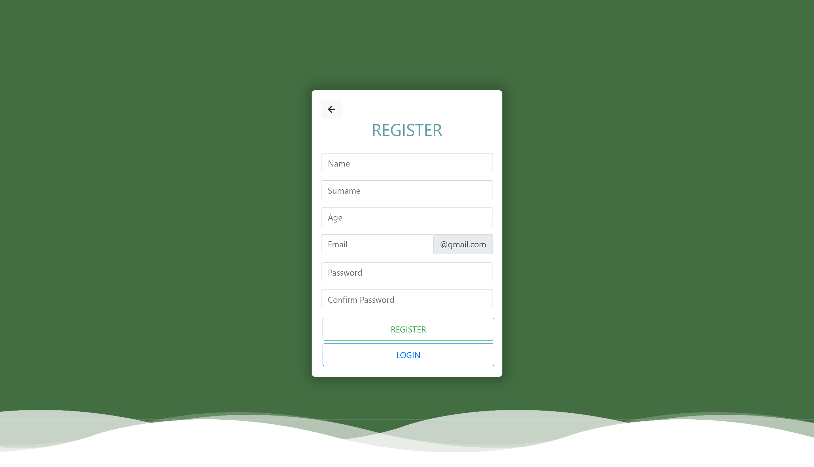
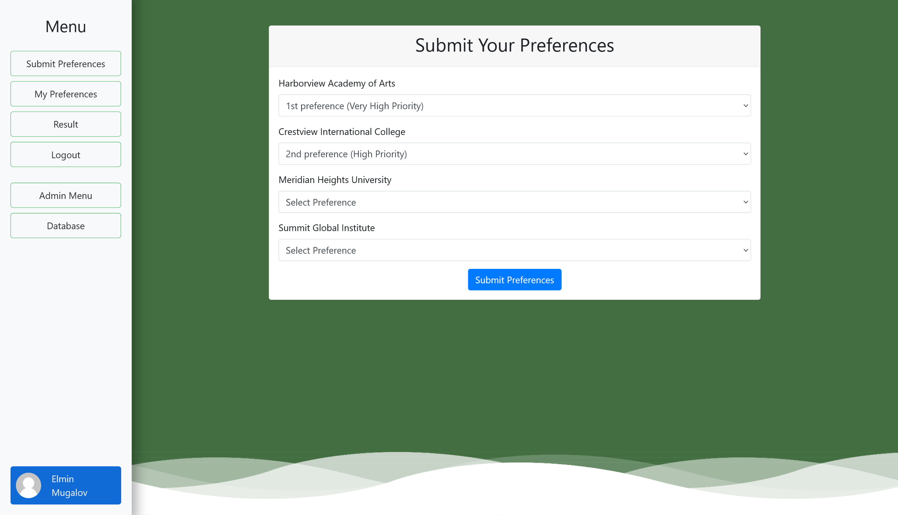
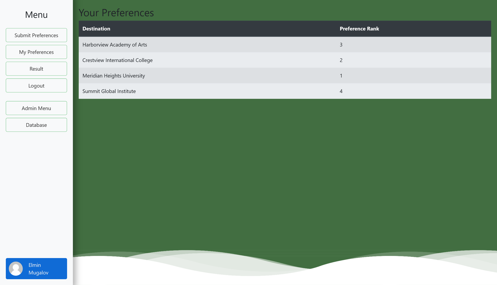
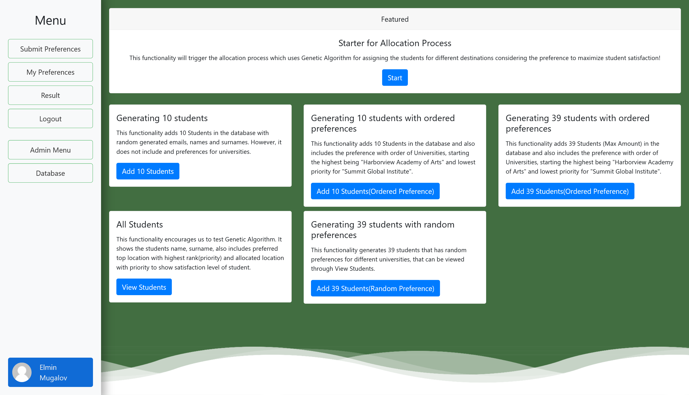
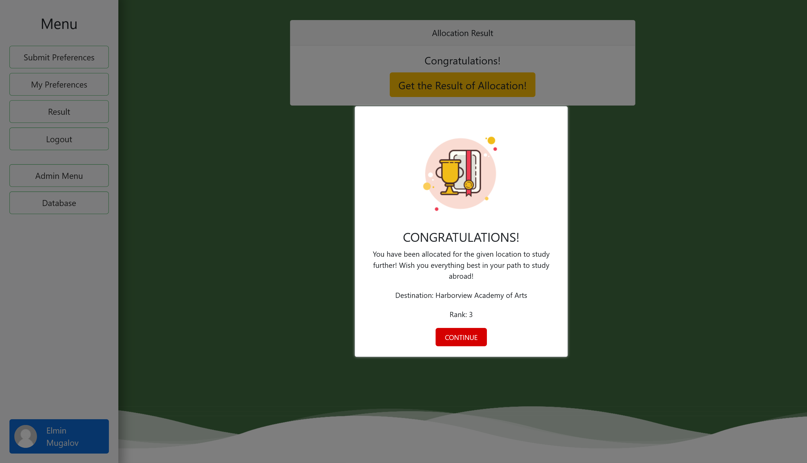

# **StudentDropper**

An advanced student allocation system leveraging a genetic algorithm to optimally assign students to their preferred destinations.

  

---

## **Table of Contents**

- [Introduction](#introduction)
- [Features](#features)
- [Technologies Used](#technologies-used)
- [Architecture Overview](#architecture-overview)
- [Setup and Installation](#setup-and-installation)
- [Usage](#usage)
  - [User Registration and Login](#user-registration-and-login)
  - [Submitting Preferences](#submitting-preferences)
  - [Viewing Allocation Results](#viewing-allocation-results)
  - [Admin Functions](#admin-functions)
- [Detailed Components](#detailed-components)
  - [Code Breakdown](#code-breakdown)
  - [Genetic Algorithm Explained](#genetic-algorithm-explained)
  - [Data Models](#data-models)
  - [Security Configuration](#security-configuration)
- [Screenshots](#screenshots)
- [Contact Information](#contact-information)
- [Conclusion](#conclusion)

---

## **Introduction**

**StudentDropper** is a cutting-edge Spring Boot application designed to manage and optimize the allocation of students to various destinations based on their preferences. By employing a sophisticated genetic algorithm, the system strives to maximize overall student satisfaction while adhering to destination capacity constraints. This project showcases the seamless integration of advanced algorithms with modern web technologies to deliver a robust and efficient solution.

---

## **Features**

- **User Authentication and Registration**
  
  - Secure login and registration for students.
  - Role-based access control distinguishing between admins and regular users.

- **Preference Submission**
  
  - Students can submit their ranked preferences for available destinations.
  - Preferences are validated and stored securely.

- **Genetic Algorithm Allocation**
  
  - An advanced algorithm allocates students to destinations optimally.
  - Considers student preferences and destination capacities.

- **Administrative Controls**
  
  - Admins can initiate the allocation process.
  - Generate mock students for testing.
  - View all students, their preferences, and allocation results.

- **Allocation Results**
  
  - Students can view their assigned destinations post-allocation.
  - Detailed results include the assigned destination and its rank in their preferences.

---

## **Technologies Used**

- **Backend:**
  
  - **Java 17**
  - **Spring Boot**
    - Spring MVC
    - Spring Security
    - Spring Data JPA
  - **Hibernate** (ORM)
  - **H2 Database** (in-memory database for development)
  - **Lombok** (to reduce boilerplate code)
  - **Genetic Algorithm** (custom implementation)

- **Frontend:**
  
  - **Thymeleaf** (server-side rendering)
  - **HTML5 & CSS3**
  - **Bootstrap 4.5**
  - **JavaScript**

---

## **Architecture Overview**

The application follows a layered architecture that promotes separation of concerns and scalability.

1. **Controller Layer**: Handles HTTP requests and responses. Interacts with the service layer to process user input and prepare data for the views.

2. **Service Layer**: Contains business logic and interacts with the repository layer. Manages operations like authentication, preference handling, and the allocation algorithm.

3. **Repository Layer**: Manages data persistence using Spring Data JPA repositories. Interfaces with the H2 database.

4. **Model Layer**: Defines the data structures and entities used throughout the application.

5. **Security Configuration**: Manages authentication and authorization using Spring Security.

6. **Views**: Thymeleaf templates render dynamic HTML pages for the user interface.

**Flow Diagram:**

```
[User Interface] <---> [Controller Layer] <---> [Service Layer] <---> [Repository Layer] <---> [Database]
```

---

## **Database Structure**

The database is structured to efficiently manage the relationships between students, their preferences, destinations, and allocation results. The application uses an **H2 in-memory database** during development.

### **Entity-Relationship Diagram**

*(TODO: Include an actual ER diagram image in the `docs` folder.)*

### **Entities and Relationships**

1. **Student**
   
   - **Fields**:
     - `id` (Primary Key)
     - `name`
     - `surname`
     - `age`
     - `email` (unique)
     - `password`
     - `role`
   - **Relationships**:
     - One-to-Many with **Preference**
     - One-to-One with **StudentAllocation**

2. **Destination**
   
   - **Fields**:
     - `id` (Primary Key)
     - `name`
     - `maxNumStudents`
   - **Relationships**:
     - One-to-Many with **Preference** (through Student)
     - One-to-Many with **StudentAllocation**

3. **Preference**
   
   - **Fields**:
     - `id` (Primary Key)
     - `rank` (1 to 4)
   - **Relationships**:
     - Many-to-One with **Student**
     - Many-to-One with **Destination**

4. **StudentAllocation**
   
   - **Fields**:
     - `id` (Primary Key)
     - `studentName`
     - `allocatedDestination`
     - `rank` (the rank of the allocated destination in the student's preferences)
   - **Relationships**:
     - One-to-One with **Student**
     - Many-to-One with **Destination**

### **Database Schema**

#### **Student Table**

| Column   | Type    | Constraints      |
| -------- | ------- | ---------------- |
| id       | Long    | Primary Key      |
| name     | String  | Not Null         |
| surname  | String  | Not Null         |
| age      | Integer |                  |
| email    | String  | Unique, Not Null |
| password | String  | Not Null         |
| role     | String  | Not Null         |

#### **Destination Table**

| Column           | Type    | Constraints |
| ---------------- | ------- | ----------- |
| id               | Long    | Primary Key |
| name             | String  | Not Null    |
| max_num_students | Integer | Not Null    |

#### **Preference Table**

| Column         | Type    | Constraints               |
| -------------- | ------- | ------------------------- |
| id             | Long    | Primary Key               |
| student_id     | Long    | Foreign Key (Student)     |
| destination_id | Long    | Foreign Key (Destination) |
| rank           | Integer | Not Null (1-4)            |

#### **StudentAllocation Table**

| Column                | Type    | Constraints                   |
| --------------------- | ------- | ----------------------------- |
| id                    | Long    | Primary Key                   |
| student_id            | Long    | Foreign Key (Student)         |
| destination_id        | Long    | Foreign Key (Destination)     |
| student_name          | String  |                               |
| allocated_destination | String  |                               |
| rank                  | Integer | Rank in student's preferences |

### **Notes on Relationships**

- **Student and Preference**: One student can have multiple preferences, but each preference is linked to one student and one destination.

- **Student and StudentAllocation**: Each student has at most one allocation result, and each allocation is linked to one student.

- **Destination and Preference**: Multiple preferences can point to the same destination.

- **Destination and StudentAllocation**: Multiple students can be allocated to the same destination, up to its capacity.

---

## **Setup and Installation**

### **Prerequisites**

- **Java 17**
- **Maven 3.6+**
- An IDE like IntelliJ IDEA or Eclipse (recommended)
- **Git**

### **Steps**

1. **Clone the Repository**
   
   ```bash
   git clone https://github.com/yourusername/StudentDropper.git
   cd StudentDropper
   ```

2. **Build the Project**
   
   ```bash
   mvn clean install
   ```

3. **Run the Application**
   
   ```bash
   mvn spring-boot:run
   ```
   
   Alternatively, you can run the `StudentDropperApplication` class from your IDE.

4. **Access the Application**
   
   Open your browser and navigate to `http://localhost:8080/login` to access the login page.

5. **Access H2 Database Console (Optional)**
   
   For database inspection, visit `http://localhost:8080/database`.

---

## **Usage**

### **User Registration and Login**

- **Register as a New Student**
  
  - Navigate to the registration page: `http://localhost:8080/register`.
  - Fill in the required details: name, surname, age, email, and password.
  - Submit the form to create your account.

- **Login**
  
  - Go to the login page: `http://localhost:8080/login`.
  - Enter your email and password.
  - Upon successful login, you'll be redirected to the main menu.

### **Submitting Preferences**

- After logging in, navigate to the preference submission page.
- Rank your preferred destinations (e.g., from 1 to 4).
- Submit your preferences.
- Note: You can only submit preferences once.

### **Viewing Allocation Results**

- Once the admin has run the allocation process, you can view your assigned destination.
- Navigate to the allocation results page (e.g., `http://localhost:8080/result`).
- Your allocated destination and its rank in your preferences will be displayed.

### **Admin Functions**

- **Login as Admin**
  
  - Use the default admin credentials or create a new admin user.
  - Admin role is identified by `ROLE_ADMIN`.

- **Admin Menu**
  
  - Access administrative functions like starting the allocation process, adding mock students, and viewing all student data.

- **Starting the Allocation Process**
  
  - From the admin menu, initiate the allocation.
  - The system will run the genetic algorithm and allocate students accordingly.

- **Generating Mock Data**
  
  - Admins can add mock students with or without preferences for testing purposes.

---

## **Detailed Components**

### **Code Breakdown**

#### **1. Configuration Classes**

- **`SecurityConfig.java`**
  
  Configures Spring Security:
  
  - Disables CSRF protection for simplicity.
  - Defines URL patterns that are publicly accessible and those that require authentication.
  - Sets up form-based login and logout handling.
  - Configures user details service and password encoder.
  
  ```java
  @Configuration
  @EnableWebSecurity
  public class SecurityConfig {
  
      private final CustomUserDetailsService customUserDetailsService;
  
      public SecurityConfig(CustomUserDetailsService customUserDetailsService) {
          this.customUserDetailsService = customUserDetailsService;
      }
  
      @Bean
      public PasswordEncoder passwordEncoder() {
          return new BCryptPasswordEncoder();
      }
  
      @Bean
      public SecurityFilterChain securityFilterChain(HttpSecurity http) throws Exception {
          return http
                  .csrf(CsrfConfigurer::disable)
                  .authorizeHttpRequests(auth -> auth
                          .requestMatchers("/home/**", "/v3/api-docs/**", "/login", "/register",
                                  "/database/**", "../static/css", "/css/**", "/js/**", "/images/**").permitAll()
                          .requestMatchers("/admin/**").hasRole("ADMIN")
                          .anyRequest().authenticated())
                  .userDetailsService(customUserDetailsService)
                  .logout(logout -> logout
                          .logoutUrl("/perform_logout")
                          .logoutSuccessUrl("/login?logout")
                          .deleteCookies("JSESSIONID")
                          .invalidateHttpSession(true)
                          .permitAll())
                  .headers(headers -> headers
                          .frameOptions(HeadersConfigurer.FrameOptionsConfig::sameOrigin))
                  .formLogin(form -> form
                          .loginPage("/login")
                          .usernameParameter("email")
                          .defaultSuccessUrl("/menu", true)
                          .permitAll())
                  .build();
      }
  }
  ```

- **`MockServiceConfig.java`**
  
  Provides beans for `DataFactory` and `Random` instances used in generating mock data.
  
  ```java
  @Configuration
  public class MockServiceConfig {
  
      @Bean
      public DataFactory dataFactory() {
          return new DataFactory();
      }
  
      @Bean
      public Random rand() {
          return new Random();
      }
  }
  ```

#### **2. Controller Classes**

- **`AuthController.java`**
  
  Manages authentication-related endpoints like login and registration.
  
  ```java
  @Controller
  public class AuthController {
  
      @GetMapping("/login")
      public String login(Model model) {
          return "login";
      }
  
      @GetMapping("/register")
      public String register(Model model) {
          model.addAttribute("student", new StudentDTO());
          return "register";
      }
  
      @PostMapping("/register")
      public String registerStudent(@ModelAttribute("student") StudentDTO studentDTO, Model model) {
          // Registration logic
      }
  }
  ```

- **`AdminController.java`**
  
  Handles administrative functions such as starting the allocation process and adding mock students.
  
  ```java
  @Controller
  @RequestMapping("/admin")
  @PreAuthorize("hasRole('ADMIN')")
  public class AdminController {
  
      @GetMapping("/start-allocation")
      public String startAllocation(Model model, Principal principal) {
          // Allocation logic
      }
  
      @GetMapping("/add-10-students")
      public String add10Students(Model model, Principal principal) {
          // Add students logic
      }
  
      // Additional admin endpoints
  }
  ```

- **`PreferenceController.java`**
  
  Handles preference submission by students.
  
  ```java
  @Controller
  public class PreferenceController {
  
      @GetMapping("/submitPreference")
      public String submitPreference(Model model, Principal principal) {
          // Preference submission logic
      }
  
      @PostMapping("/submitPreference")
      public String submitPreference(@ModelAttribute PreferenceFormDTO formDTO, Principal principal, RedirectAttributes redirectAttributes) {
          // Save preferences
      }
  
      @GetMapping("/myPreferences")
      public String myPreferences(Model model, Principal principal) {
          // Retrieve preferences
      }
  }
  ```

#### **3. Service Classes**

- **`AuthService.java`**
  
  Manages student registration.
  
  ```java
  @Service
  public class AuthService {
  
      public void registerStudent(StudentDTO studentDTO) {
          // Registration logic
      }
  
      private boolean emailExists(String email) {
          // Check if email exists
      }
  }
  ```

- **`PreferenceService.java`**
  
  Manages operations related to student preferences.
  
  ```java
  @Service
  public class PreferenceService {
  
      public void savePreferences(Student student, List<PreferenceDTO> preferenceDTOS) {
          // Save preferences
      }
  
      public List<PreferenceDTO> findPreferencesByStudent(Student student) {
          // Retrieve preferences
      }
  }
  ```

- **`GeneticAlgorithmService.java`**
  
  Contains the core logic for the genetic algorithm used in the allocation process.
  
  ```java
  @Service
  public class GeneticAlgorithmService {
  
      public void startAllocationProcess() {
          // Start allocation
      }
  
      public Chromosome runGeneticAlgorithm(List<Student> students, List<Destination> destinations) {
          // Run genetic algorithm
      }
  
      private double calculateFitness(Chromosome chromosome) {
          // Calculate fitness
      }
  
      // Additional methods: generateInitialPopulation, selectParents, crossover, mutate
  }
  ```

#### **4. Model Classes**

- **`Student.java`**
  
  Represents a student entity.
  
  ```java
  @Entity
  public class Student {
  
      @Id
      @GeneratedValue(strategy = GenerationType.IDENTITY)
      Long id;
      String name;
      String surname;
      Integer age;
      String email;
      String password;
      String role;
  
      @OneToMany(mappedBy = "student", cascade = CascadeType.ALL)
      private List<Preference> preferences;
  
      public int getPreferencesRank(Destination destination) {
          // Retrieve preference rank
      }
  }
  ```

- **`Destination.java`**
  
  Represents a destination entity.
  
  ```java
  @Entity
  public class Destination {
  
      @Id
      @GeneratedValue(strategy = GenerationType.IDENTITY)
      Long id;
      String name;
      int maxNumStudents;
  }
  ```

- **`Preference.java`**
  
  Represents a student's preference for a destination.
  
  ```java
  @Entity
  public class Preference {
  
      @Id
      @GeneratedValue(strategy = GenerationType.IDENTITY)
      Long id;
  
      @ManyToOne(fetch = FetchType.LAZY)
      @JoinColumn(name = "student_id")
      Student student;
  
      @ManyToOne(fetch = FetchType.LAZY)
      @JoinColumn(name = "destination_id")
      Destination destination;
  
      int rank;
  }
  ```

#### **5. Repository Interfaces**

- **`StudentRepository.java`**
  
  Manages `Student` entities.
  
  ```java
  @Repository
  public interface StudentRepository extends JpaRepository<Student, Long> {
      Student findByEmail(String email);
  }
  ```

- **`DestinationRepository.java`**
  
  Provides database access methods for `Destination` entities.
  
  ```java
  @Repository
  public interface DestinationRepository extends JpaRepository<Destination, Integer> {
      Optional<Destination> findById(Long destinationId);
  }
  ```

- **`PreferenceRepository.java`**
  
  Manages `Preference` entities.
  
  ```java
  @Repository
  public interface PreferenceRepository extends JpaRepository<Preference, Long> {
      List<Preference> findByStudent(Student student);
  }
  ```

### **Genetic Algorithm Explained**

The genetic algorithm aims to find the optimal allocation of students to destinations by simulating the process of natural selection.

**Key Steps:**

1. **Initialization**
   
   - Generate an initial population of possible allocations (chromosomes).
   - The initial population includes random allocations and a heuristic-based allocation.

2. **Fitness Calculation**
   
   - Each chromosome's fitness is calculated based on how well it satisfies student preferences.
   - Higher fitness is awarded for allocations matching higher-ranked preferences.

3. **Selection**
   
   - Parents are selected from the population based on their fitness.
   - Fitness-proportionate selection ensures better solutions have a higher chance of passing on their genes.

4. **Crossover**
   
   - Pairs of parents produce offspring by combining parts of their allocations.
   - This introduces new allocations into the population.

5. **Mutation**
   
   - Random changes are introduced to some offspring to maintain genetic diversity.
   - Mutation might change a student's assigned destination within capacity constraints.

6. **Iteration**
   
   - Steps 2 to 5 are repeated for a set number of generations or until convergence.
   - The best solution found is used for the final allocation.

**Implementation Details:**

- **Chromosome Representation**
  
  - A chromosome represents an allocation mapping of students to destinations.
  
  - Example:
    
    ```java
    public class Chromosome {
        private Map<Student, Destination> allocation;
        private double fitness;
    }
    ```

- **Fitness Function**
  
  - The fitness function calculates the total satisfaction based on student preferences.
  - Preferences are ranked from 1 (highest) to 4 (lowest).
  
  ```java
  private double calculateFitness(Chromosome chromosome) {
      double fitness = 0.0;
      for (Map.Entry<Student, Destination> entry : chromosome.getAllocation().entrySet()) {
          Student student = entry.getKey();
          Destination destination = entry.getValue();
          int preferenceRank = student.getPreferencesRank(destination);
  
          if (preferenceRank > PREFERENCE_SCALE) {
              fitness -= 10; // Penalty for unpreferred destinations
          } else {
              fitness += Math.pow(PREFERENCE_SCALE + 1 - preferenceRank, 2);
              if (preferenceRank == 1) {
                  fitness += BONUS_FOR_TOP_PREFERENCE;
              }
          }
      }
      chromosome.setFitness(fitness);
      return fitness;
  }
  ```

- **Selection Mechanism**
  
  - Uses fitness-proportionate (roulette wheel) selection.
  
  ```java
  private List<Chromosome> selectParents(List<Chromosome> population) {
      // Selection logic
  }
  ```

- **Crossover and Mutation**
  
  - Crossover combines parent chromosomes to produce offspring.
  - Mutation introduces random changes.
  
  ```java
  private Chromosome crossover(Chromosome parent1, Chromosome parent2, List<Destination> destinations) {
      // Crossover logic
  }
  
  private void mutate(Chromosome chromosome) {
      // Mutation logic
  }
  ```

---

### Security Configuration

Security is a critical aspect of the application, ensuring that user data is protected and access to functionalities is properly controlled.

#### **Spring Security Setup**

- **Authentication**: Verifies the identity of users trying to access the application.

- **Authorization**: Determines what authenticated users are allowed to do (e.g., access certain endpoints).

#### **Role-Based Access Control (RBAC)**

- **Roles Defined**:
  - `ROLE_USER`: Regular students who can register, submit preferences, and view allocation results.
  - `ROLE_ADMIN`: Administrators with elevated privileges, such as starting the allocation process and managing student data.

#### **Password Encoding**

- Passwords are encoded using **BCryptPasswordEncoder**, a strong hashing function that adds a salt to protect against rainbow table attacks.
  
  ```java
  @Bean
  public PasswordEncoder passwordEncoder() {
      return new BCryptPasswordEncoder();
  }
  ```

#### **Security Configuration Class**

- **`SecurityConfig.java`**: Centralizes all security-related configurations.
  
  ```java
  @Configuration
  @EnableWebSecurity
  public class SecurityConfig {
  
      private final CustomUserDetailsService customUserDetailsService;
  
      public SecurityConfig(CustomUserDetailsService customUserDetailsService) {
          this.customUserDetailsService = customUserDetailsService;
      }
  
      @Bean
      public SecurityFilterChain securityFilterChain(HttpSecurity http) throws Exception {
          return http
                  .csrf(CsrfConfigurer::disable) // CSRF protection is disabled for simplicity
                  .authorizeHttpRequests(auth -> auth
                          .requestMatchers("/home/**", "/login", "/register", "/css/**", "/js/**", "/images/**").permitAll()
                          .requestMatchers("/admin/**").hasRole("ADMIN")
                          .anyRequest().authenticated())
                  .userDetailsService(customUserDetailsService)
                  .logout(logout -> logout
                          .logoutUrl("/perform_logout")
                          .logoutSuccessUrl("/login?logout")
                          .deleteCookies("JSESSIONID")
                          .invalidateHttpSession(true)
                          .permitAll())
                  .headers(headers -> headers
                          .frameOptions(HeadersConfigurer.FrameOptionsConfig::sameOrigin))
                  .formLogin(form -> form
                          .loginPage("/login")
                          .usernameParameter("email")
                          .defaultSuccessUrl("/menu", true)
                          .permitAll())
                  .build();
      }
  }
  ```

- **Key Configurations**:
  
  - **CSRF Protection Disabled**: For simplicity, Cross-Site Request Forgery protection is disabled. In a production environment, it should be enabled and properly configured.
  
  - **Authorization Rules**:
    
    - **Permit All**: Publicly accessible endpoints like `/login`, `/register`, and static resources.
    - **Admin Access**: Endpoints under `/admin/**` are restricted to users with the `ADMIN` role.
    - **Authenticated Users**: All other endpoints require authentication.
  
  - **Form-Based Authentication**:
    
    - Custom login page at `/login`.
    - Username parameter is set to `email`.
    - Default success URL is `/menu` after login.
  
  - **Logout Configuration**:
    
    - Logout URL is `/perform_logout`.
    - On logout, the session is invalidated, and the user is redirected to the login page with a logout message.

#### **Custom User Details Service**

- **`CustomUserDetailsService.java`**: Implements `UserDetailsService` to load user-specific data during authentication.
  
  ```java
  @Service
  @RequiredArgsConstructor
  public class CustomUserDetailsService implements UserDetailsService {
  
      private final StudentRepository studentRepository;
  
      @Override
      public UserDetails loadUserByUsername(String email) throws UsernameNotFoundException {
          Student student = studentRepository.findByEmail(email);
          if (student == null) {
              throw new UsernameNotFoundException("Student not found with email: " + email);
          }
  
          String role = student.getRole();
          if (role == null || role.trim().isEmpty()) {
              throw new UsernameNotFoundException("No role assigned for user with email: " + email);
          }
  
          return User.builder()
                  .username(student.getEmail())
                  .password(student.getPassword())
                  .authorities(student.getRole())
                  .build();
      }
  }
  ```

- **Functionality**:
  
  - Retrieves the `Student` entity by email from the database.
  - Verifies that the student exists and has a role assigned.
  - Builds a `UserDetails` object with the student's email, password, and authorities.

#### **Password Encoding in Registration**

- When a new student registers, their password is encoded before being saved to the database.
  
  ```java
  @Service
  @RequiredArgsConstructor
  public class AuthService {
  
      private final StudentRepository studentRepository;
      private final PasswordEncoder passwordEncoder;
  
      public void registerStudent(StudentDTO studentDTO) {
          if (emailExists(studentDTO.getEmail())) {
              throw new EntityExistsException("Student with this email already exists");
          }
  
          Student student = new Student();
          student.setName(studentDTO.getName());
          student.setSurname(studentDTO.getSurname());
          student.setAge(studentDTO.getAge());
          student.setEmail(studentDTO.getEmail());
          student.setRole("ROLE_USER");
          student.setPassword(passwordEncoder.encode(studentDTO.getPassword()));
  
          studentRepository.save(student);
      }
  
      private boolean emailExists(String email) {
          return studentRepository.findByEmail(email) != null;
      }
  }
  ```

- **Key Points**:
  
  - **Email Uniqueness**: Checks if the email already exists to prevent duplicate accounts.
  - **Password Encoding**: Uses `passwordEncoder.encode()` to hash the password.

#### **Role-Based Access in Controllers**

- **AdminController**: Secured with `@PreAuthorize("hasRole('ADMIN')")`.
  
  ```java
  @Controller
  @RequestMapping("/admin")
  @PreAuthorize("hasRole('ADMIN')")
  public class AdminController {
      // Admin-specific endpoints
  }
  ```

- **Thymeleaf Security Extras**: Used in templates to display or hide content based on roles.
  
  ```html
  <div sec:authorize="hasAuthority('ROLE_ADMIN')">
      <a th:href="@{/admin/menu}" class="btn btn-outline-success">Admin Menu</a>
      <!-- Additional admin links -->
  </div>
  ```

---

## **Screenshots**

Below are screenshots of the application showcasing various functionalities. All images are located in the `docs` folder.

1. **Login Page**
   
   

2. **Registration Page**
   
   

3. **Main Menu**
   
   

4. **Preference Submission**
   
   

5. **View Preferences**
   
   

6. **Admin Menu**
   
   

7. **Allocation Results**
   
   

---

## **Contact Information**

For questions, suggestions, or feedback:

- **Email**: [elmingameboy@gmail.com](mailto:elmingameboy@gmail.com)

---

## **Conclusion**

**StudentDropper** exemplifies the powerful synergy between advanced algorithms and modern web technologies. By leveraging a genetic algorithm within a Spring Boot application, it provides an efficient and scalable solution to the complex problem of student allocation. The project's meticulous architecture, robust security measures, and user-friendly interface make it a standout example of innovation and technical excellence.

---
